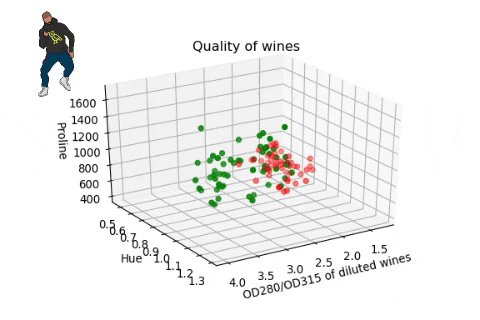

# wine-visualization



Working with multivariate data and response techniques that demonstrate the quality of wine. The data used are composed of 13 variables that describe wine characteristics and another one that determines its quality (class).

To install NumPy, type the following code at a command prompt:

```
pip install numpy
```
To install matplotlib, type the following code at a command prompt:

```
pip install matplotlib
```
